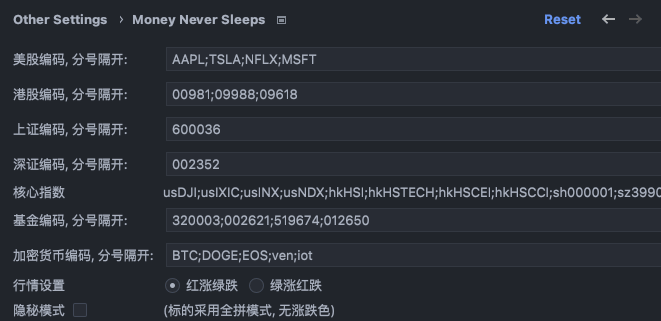
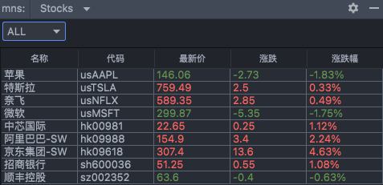
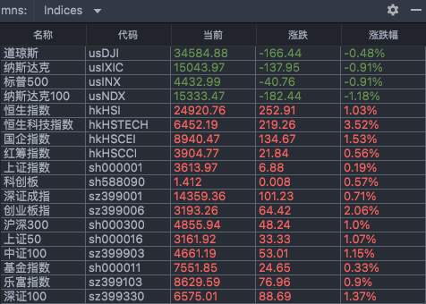
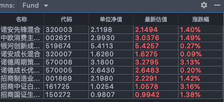
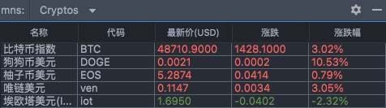
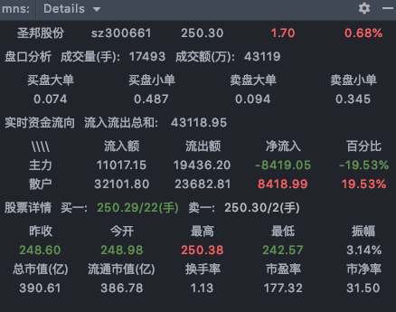
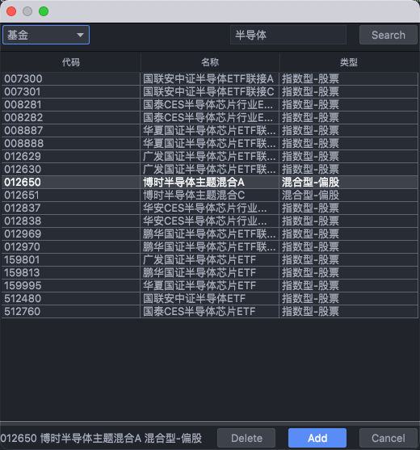

# Lucky Clover

> 基于 [mns (Money Never Sleeps)](https://github.com/bytebeats/mns) 开发，开发时原项目为 MIT License

IntelliJ IDEA平台插件. 支持查看股票实时行情. 支持<b>股票</b>, <b>基金</b>和<b>数字货币</b>. 其中股票包括<b>美股</b>, <b>港股</b>和 <b>A 股</b>.

## Notes
* Double left-click on item of indices or stocks, you'll see k-line charts poped-up; Single right-click, you'll lucky clover chart type options. 双击鼠标左键, 你会看到股票行情图; 单击鼠标右键, 你会看到股票行情图分类;
* Double left-click on item of funds, you'll see k-line charts poped-up; Single right-click, you'll see fund chart type options. 基金点击操作如上.
* In Setting page, symbols should be separated by comma/blanket/colon in English; 股票/基金/加密货币编码请用英语的逗号, 冒号或者空格分隔. 不要用汉字或者其它语言的标识符号.
* symbols of supported Crypto currencies, please check in [Here](https://finance.sina.com.cn/blockchain/hq.shtml). 数字货币代码请从 [这里](https://finance.sina.com.cn/blockchain/hq.shtml) 查找.
* Stock service is supported by Tencent. Please check symbols [Here](https://stockapp.finance.qq.com/mstats/). 股票代码请从查找 [这里](https://stockapp.finance.qq.com/mstats/).
* Fund service is supported by TianTian funds. Please check fund symbols [Here](https://fund.eastmoney.com). 基金代码请从 [这里](https://fund.eastmoney.com) 查找

## Installation:
* `IntelliJ IDEA` -> `Preferences` -> `Plugins` -> `Marketplace`, type `lc`/`lucky`/`lucky clover` to search and install.

## Questions
* Where to add symbols?
  * `IntelliJ IDEA` -> `Preferences` -> `Other Settings` -> `Lucky Clover`
* How to check fund k-line charts?
  * double left-click or sing right-click on fund list, you'll see popup windows.

## Usage:

Lucky Clover is IntelliJ IDEA plugin, which means all IDEs who base on IntelliJ supports lucky clover, namely <b>IntelliJ/Android Studio/PyCharm/CLion/GoLand/AppCode/Rider/WebStorm</b> and so on.

Lucky Clover是 IntelliJ 平台插件, 所有基于 IntelliJ 平台的 IDE 都会支持 lucky clover 插件. 诸如 <b>IntelliJ/Android Studio/PyCharm/CLion/GoLand/AppCode/Rider/WebStorm</b> 等等.

Settings:

Stocks:

Indices:

Funds:

Digital Currencies:

Stock Details:

Fund Query:

## MIT License

    Copyright (c) 2021 Chen Pan
    Copyright (c) 2026 SilverTime

    Permission is hereby granted, free of charge, to any person obtaining a copy
    of this software and associated documentation files (the "Software"), to deal
    in the Software without restriction, including without limitation the rights
    to use, copy, modify, merge, publish, distribute, sublicense, and/or sell
    copies of the Software, and to permit persons to whom the Software is
    furnished to do so, subject to the following conditions:

    The above copyright notice and this permission notice shall be included in all
    copies or substantial portions of the Software.

    THE SOFTWARE IS PROVIDED "AS IS", WITHOUT WARRANTY OF ANY KIND, EXPRESS OR
    IMPLIED, INCLUDING BUT NOT LIMITED TO THE WARRANTIES OF MERCHANTABILITY,
    FITNESS FOR A PARTICULAR PURPOSE AND NONINFRINGEMENT. IN NO EVENT SHALL THE
    AUTHORS OR COPYRIGHT HOLDERS BE LIABLE FOR ANY CLAIM, DAMAGES OR OTHER
    LIABILITY, WHETHER IN AN ACTION OF CONTRACT, TORT OR OTHERWISE, ARISING FROM,
    OUT OF OR IN CONNECTION WITH THE SOFTWARE OR THE USE OR OTHER DEALINGS IN THE
    SOFTWARE.

