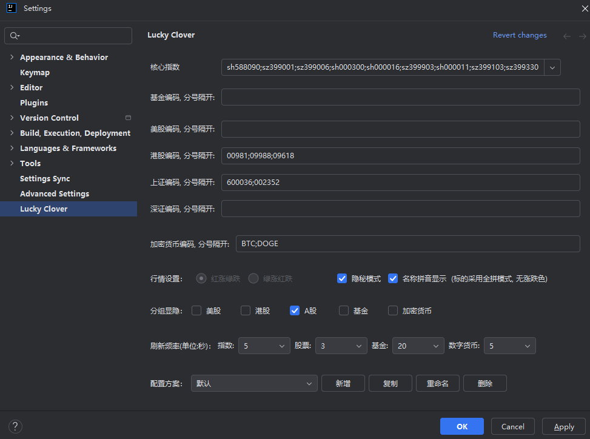

# Lucky Clover 幸运草

<div align="center">


**一款功能强大的 IntelliJ 平台金融行情插件**

[English](#english) | [中文](#chinese)

</div>

---

## <a name="chinese"></a>📖 中文文档

### ✨ 项目简介

Lucky Clover 是一款基于 [mns (Money Never Sleeps)](https://github.com/bytebeats/mns) 项目开发的 IntelliJ 平台插件。该插件为开发者提供便捷的金融行情查看功能，支持实时监控股票、基金和数字货币的市场动态，让您在编码的同时不错过任何投资机会。

### 🎯 核心特性

- **📈 多市场支持**
  - 美股 (US Stocks)
  - 港股 (HK Stocks)
  - A 股 (A-Share)
  - 核心指数 (Core Indices)
  - 基金 (Funds)
  - 数字货币 (Digital Currencies)

- **📊 实时行情**
  - 实时价格更新
  - 涨跌幅显示
  - 成交量统计
  - K 线图表展示

- **🎨 丰富的图表类型**
  - 日 K 线图
  - 周 K 线图
  - 月 K 线图
  - 分钟级图表

- **⚙️ 灵活配置**
  - 自定义关注列表
  - 多种分隔符支持
  - 个性化设置选项

- **🔍 便捷查询**
  - 基金搜索功能
  - 股票详情查看
  - 快速跳转外部资源

### 📦 安装指南

#### 方式一：通过 JetBrains Marketplace 安装（推荐）

1. 打开 IntelliJ IDEA 或其他基于 IntelliJ 平台的 IDE
2. 进入 `File` → `Settings` → `Plugins`
3. 切换到 `Marketplace` 标签
4. 搜索 `Lucky Clover`、`lc` 或 `lucky`
5. 点击 `Install` 按钮进行安装
6. 重启 IDE 完成安装

#### 方式二：手动安装

1. 从 [GitHub Releases](https://github.com/SilverTime/lucky-clover/releases) 下载最新版本的插件包
2. 打开 `File` → `Settings` → `Plugins`
3. 点击齿轮图标，选择 `Install Plugin from Disk...`
4. 选择下载的插件包文件
5. 重启 IDE 完成安装

### 🚀 快速开始

#### 配置关注列表

1. 打开 `File` → `Settings` → `Other Settings` → `Lucky Clover`
2. 在对应的输入框中添加您关注的股票/基金/数字货币代码
3. 使用英文逗号、冒号或空格分隔多个代码
4. 点击 `Apply` 保存设置

#### 查看行情

- **股票行情**：在主窗口中查看实时股票价格和涨跌幅
- **指数行情**：查看核心指数的实时表现
- **基金行情**：监控基金的净值变化
- **数字货币**：追踪加密货币的市场动态

### 📝 使用说明

#### 交互操作

| 操作 | 功能 |
|------|------|
| 双击左键 | 打开 K 线图表详情窗口 |
| 单击右键 | 切换图表类型（日K/周K/月K等） |
| 刷新按钮 | 手动刷新行情数据 |

#### 代码格式说明

**股票代码**
- A 股：`sh600519`（贵州茅台）、`sz000858`（五粮液）
- 港股：`hk00700`（腾讯控股）
- 美股：`usAAPL`（苹果公司）

**基金代码**
- 基金代码：`000001`（华夏成长）、`110022`（易方达消费行业）

**数字货币代码**
- 比特币：`btc`
- 以太坊：`eth`
- 更多代码请参考：[新浪数字货币行情](https://finance.sina.com.cn/blockchain/hq.shtml)

#### 数据来源

- **股票数据**：腾讯财经 - [股票代码查询](https://stockapp.finance.qq.com/mstats/)
- **基金数据**：天天基金 - [基金代码查询](https://fund.eastmoney.com)
- **数字货币数据**：新浪财经 - [数字货币行情](https://finance.sina.com.cn/blockchain/hq.shtml)

### 🖼️ 界面预览

#### 设置界面


#### 股票行情


#### 核心指数


#### 基金行情


#### 数字货币


#### 股票详情


#### 基金查询


### ❓ 常见问题

<details>
<summary><b>如何添加关注的股票/基金？</b></summary>

进入 `File` → `Settings` → `Other Settings` → `Lucky Clover`，在对应的输入框中添加代码，使用英文逗号、冒号或空格分隔。
</details>

<details>
<summary><b>如何查看基金的 K 线图？</b></summary>

在基金列表中双击左键即可打开 K 线图表窗口，单击右键可以切换不同的图表类型。
</details>

<details>
<summary><b>支持哪些 IDE？</b></summary>

所有基于 IntelliJ 平台的 IDE 都支持 Lucky Clover，包括：
- IntelliJ IDEA
- Android Studio
- PyCharm
- CLion
- GoLand
- AppCode
- Rider
- WebStorm
- DataGrip
- PhpStorm
</details>

<details>
<summary><b>为什么行情数据不更新？</b></summary>

请检查网络连接是否正常，并确认当前是否在交易时间内。非交易时间数据可能不会更新。
</details>

<details>
<summary><b>如何分隔多个代码？</b></summary>

请使用英文的冒号（`:`）分隔多个代码。不要使用中文标点符号或其他语言的分隔符。
</details>

### 🛠️ 技术栈

- **开发语言**：Java / Kotlin
- **构建工具**：Gradle
- **目标平台**：IntelliJ Platform
- **最低 IDE 版本**：2020.3
- **数据来源**：腾讯财经、天天基金、新浪财经

### 🤝 贡献指南

我们欢迎任何形式的贡献！

1. Fork 本仓库
2. 创建您的特性分支 (`git checkout -b feature/AmazingFeature`)
3. 提交您的更改 (`git commit -m 'Add some AmazingFeature'`)
4. 推送到分支 (`git push origin feature/AmazingFeature`)
5. 开启一个 Pull Request

### 📄 许可证

本项目基于 MIT 许可证开源。原项目 [mns (Money Never Sleeps)](https://github.com/bytebeats/mns) 同样使用 MIT 许可证。

```
Copyright (c) 2021 Chen Pan
Copyright (c) 2026 SilverTime

Permission is hereby granted, free of charge, to any person obtaining a copy
of this software and associated documentation files (the "Software"), to deal
in the Software without restriction, including without limitation the rights
to use, copy, modify, merge, publish, distribute, sublicense, and/or sell
copies of the Software, and to permit persons to whom the Software is
furnished to do so, subject to the following conditions:

The above copyright notice and this permission notice shall be included in all
copies or substantial portions of the Software.

THE SOFTWARE IS PROVIDED "AS IS", WITHOUT WARRANTY OF ANY KIND, EXPRESS OR
IMPLIED, INCLUDING BUT NOT LIMITED TO THE WARRANTIES OF MERCHANTABILITY,
FITNESS FOR A PARTICULAR PURPOSE AND NONINFRINGEMENT. IN NO EVENT SHALL THE
AUTHORS OR COPYRIGHT HOLDERS BE LIABLE FOR ANY CLAIM, DAMAGES OR OTHER
LIABILITY, WHETHER IN AN ACTION OF CONTRACT, TORT OR OTHERWISE, ARISING FROM,
OUT OF OR IN CONNECTION WITH THE SOFTWARE OR THE USE OR OTHER DEALINGS IN THE
SOFTWARE.
```

### 🙏 致谢

- 感谢 [bytebeats](https://github.com/bytebeats) 创建的原始项目 [mns (Money Never Sleeps)](https://github.com/bytebeats/mns)
- 感谢所有为本项目做出贡献的开发者
- 感谢 JetBrains 提供优秀的开发平台

### 📮 联系方式

- **GitHub**: [SilverTime/lucky-clover](https://github.com/SilverTime/lucky-clover)
- **Issues**: [提交问题](https://github.com/SilverTime/lucky-clover/issues)

---

## <a name="english"></a>📖 English Documentation

### ✨ Introduction

Lucky Clover is a powerful IntelliJ platform plugin developed based on the [mns (Money Never Sleeps)](https://github.com/bytebeats/mns) project. This plugin provides developers with convenient financial market viewing capabilities, supporting real-time monitoring of stocks, funds, and digital currencies, so you won't miss any investment opportunities while coding.

### 🎯 Key Features

- **📈 Multi-Market Support**
  - US Stocks
  - HK Stocks
  - A-Share
  - Core Indices
  - Funds
  - Digital Currencies

- **📊 Real-time Quotes**
  - Real-time price updates
  - Price change percentage
  - Trading volume statistics
  - K-line chart display

- **🎨 Rich Chart Types**
  - Daily K-line charts
  - Weekly K-line charts
  - Monthly K-line charts
  - Minute-level charts

- **⚙️ Flexible Configuration**
  - Custom watchlist
  - Multiple separator support
  - Personalized settings

- **🔍 Convenient Search**
  - Fund search functionality
  - Stock details viewing
  - Quick access to external resources

### 📦 Installation

#### Method 1: Install via JetBrains Marketplace (Recommended)

1. Open IntelliJ IDEA or other IntelliJ-based IDE
2. Go to `File` → `Settings` → `Plugins`
3. Switch to the `Marketplace` tab
4. Search for `Lucky Clover`, `lc`, or `lucky`
5. Click the `Install` button
6. Restart the IDE to complete the installation

#### Method 2: Manual Installation

1. Download the latest plugin package from [GitHub Releases](https://github.com/SilverTime/lucky-clover/releases)
2. Open `File` → `Settings` → `Plugins`
3. Click the gear icon and select `Install Plugin from Disk...`
4. Select the downloaded plugin file
5. Restart the IDE to complete the installation

### 🚀 Quick Start

#### Configure Watchlist

1. Open `File` → `Settings` → `Other Settings` → `Lucky Clover`
2. Add your stock/fund/cryptocurrency codes in the corresponding input fields
3. Separate multiple codes with English commas, colons, or spaces
4. Click `Apply` to save settings

#### View Quotes

- **Stock Quotes**: View real-time stock prices and changes in the main window
- **Index Quotes**: Monitor real-time performance of core indices
- **Fund Quotes**: Track fund net value changes
- **Digital Currencies**: Follow cryptocurrency market dynamics

### 📝 Usage Guide

#### Interaction Operations

| Operation | Function |
|-----------|----------|
| Double-click left button | Open K-line chart detail window |
| Single-click right button | Switch chart type (daily/weekly/monthly, etc.) |
| Refresh button | Manually refresh quote data |

#### Code Format

**Stock Codes**
- A-Share: `sh600519` (Kweichow Moutai), `sz000858` (Wuliangye)
- HK Stocks: `hk00700` (Tencent Holdings)
- US Stocks: `usAAPL` (Apple Inc.)

**Fund Codes**
- Fund codes: `000001` (China Asset Management Growth), `110022` (E Fund Consumer Industry)

**Cryptocurrency Codes**
- Bitcoin: `btc`
- Ethereum: `eth`
- For more codes, visit: [Sina Cryptocurrency Quotes](https://finance.sina.com.cn/blockchain/hq.shtml)

#### Data Sources

- **Stock Data**: Tencent Finance - [Stock Code Query](https://stockapp.finance.qq.com/mstats/)
- **Fund Data**: TianTian Funds - [Fund Code Query](https://fund.eastmoney.com)
- **Cryptocurrency Data**: Sina Finance - [Cryptocurrency Quotes](https://finance.sina.com.cn/blockchain/hq.shtml)

### 🖼️ Interface Preview

#### Settings


#### Stocks


#### Core Indices


#### Funds


#### Digital Currencies


#### Stock Details


#### Fund Query


### ❓ FAQ

<details>
<summary><b>How do I add stocks/funds to my watchlist?</b></summary>

Go to `File` → `Settings` → `Other Settings` → `Lucky Clover`, add codes in the corresponding input fields, and separate multiple codes with English commas, colons, or spaces.
</details>

<details>
<summary><b>How do I view fund K-line charts?</b></summary>

Double-click left button on the fund list to open the K-line chart window. Single-click right button to switch between different chart types.
</details>

<details>
<summary><b>Which IDEs are supported?</b></summary>

All IntelliJ-based IDEs support Lucky Clover, including:
- IntelliJ IDEA
- Android Studio
- PyCharm
- CLion
- GoLand
- AppCode
- Rider
- WebStorm
- DataGrip
- PhpStorm
</details>

<details>
<summary><b>Why is the quote data not updating?</b></summary>

Please check your network connection and confirm if it's currently within trading hours. Data may not update outside of trading hours.
</details>

<details>
<summary><b>How do I separate multiple codes?</b></summary>

Please use English commas (`,`), colons (`:`), or spaces (` `) to separate multiple codes. Do not use Chinese punctuation or other language separators.
</details>

### 🛠️ Tech Stack

- **Development Language**: Java / Kotlin
- **Build Tool**: Gradle
- **Target Platform**: IntelliJ Platform
- **Minimum IDE Version**: 2020.3
- **Data Sources**: Tencent Finance, TianTian Funds, Sina Finance

### 🤝 Contributing

We welcome any form of contribution!

1. Fork this repository
2. Create your feature branch (`git checkout -b feature/AmazingFeature`)
3. Commit your changes (`git commit -m 'Add some AmazingFeature'`)
4. Push to the branch (`git push origin feature/AmazingFeature`)
5. Open a Pull Request

### 📄 License

This project is open source under the MIT License. The original project [mns (Money Never Sleeps)](https://github.com/bytebeats/mns) is also licensed under MIT.

```
Copyright (c) 2021 Chen Pan
Copyright (c) 2026 SilverTime

Permission is hereby granted, free of charge, to any person obtaining a copy
of this software and associated documentation files (the "Software"), to deal
in the Software without restriction, including without limitation the rights
to use, copy, modify, merge, publish, distribute, sublicense, and/or sell
copies of the Software, and to permit persons to whom the Software is
furnished to do so, subject to the following conditions:

The above copyright notice and this permission notice shall be included in all
copies or substantial portions of the Software.

THE SOFTWARE IS PROVIDED "AS IS", WITHOUT WARRANTY OF ANY KIND, EXPRESS OR
IMPLIED, INCLUDING BUT NOT LIMITED TO THE WARRANTIES OF MERCHANTABILITY,
FITNESS FOR A PARTICULAR PURPOSE AND NONINFRINGEMENT. IN NO EVENT SHALL THE
AUTHORS OR COPYRIGHT HOLDERS BE LIABLE FOR ANY CLAIM, DAMAGES OR OTHER
LIABILITY, WHETHER IN AN ACTION OF CONTRACT, TORT OR OTHERWISE, ARISING FROM,
OUT OF OR IN CONNECTION WITH THE SOFTWARE OR THE USE OR OTHER DEALINGS IN THE
SOFTWARE.
```

### 🙏 Acknowledgments

- Thanks to [bytebeats](https://github.com/bytebeats) for creating the original project [mns (Money Never Sleeps)](https://github.com/bytebeats/mns)
- Thanks to all developers who have contributed to this project
- Thanks to JetBrains for providing an excellent development platform

### 📮 Contact

- **GitHub**: [SilverTime/lucky-clover](https://github.com/SilverTime/lucky-clover)
- **Issues**: [Submit an Issue](https://github.com/SilverTime/lucky-clover/issues)

---

<div align="center">

**⭐ If you find this project helpful, please consider giving it a star! ⭐**

Made with ❤️ by SilverTime

</div>
